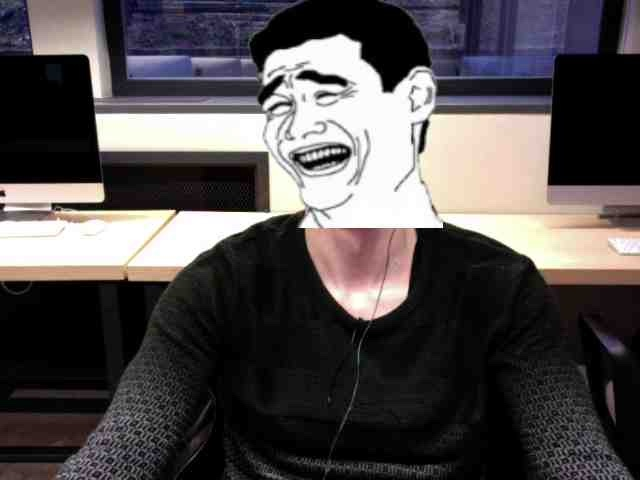
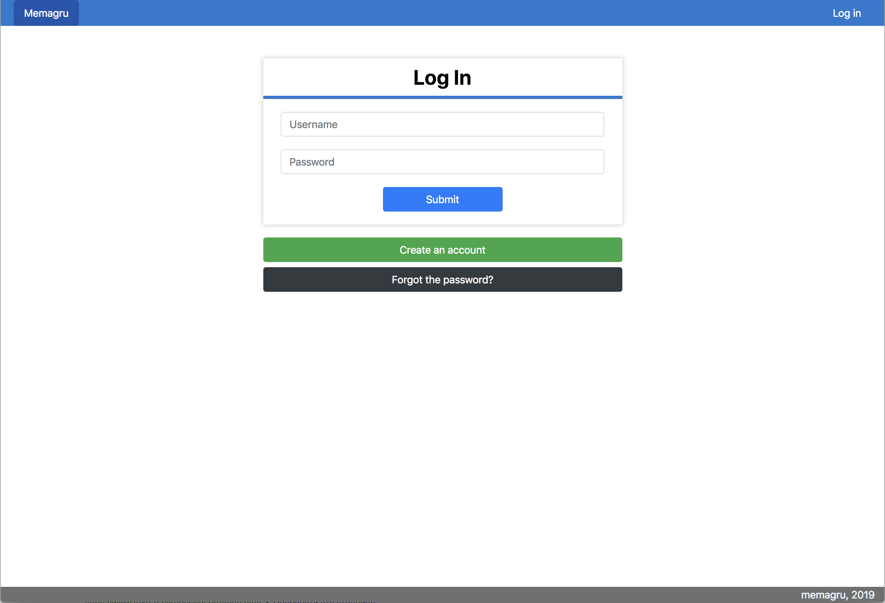
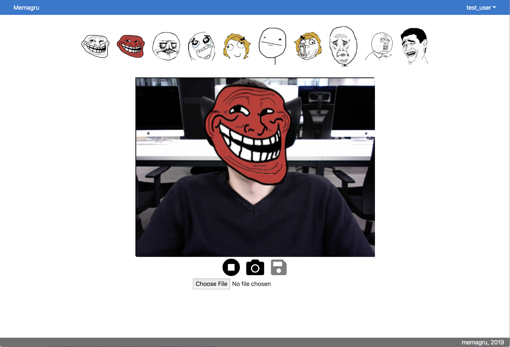
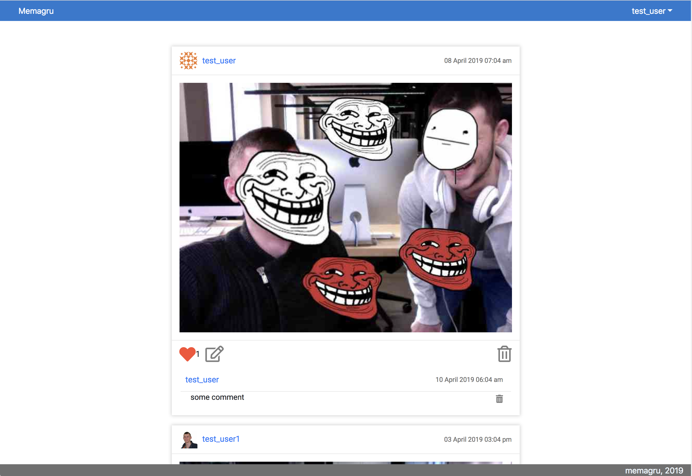

# 42_camagru

First web project of 42 school.

It is an instagram-like responsive web application, written in pure PHP, JS, and CSS.  
Implemented interacting with a webcam.

Using this app, you can create photos like this:

### Some screenshots:

Login page:

Photo creation page:

Ribbon page:

